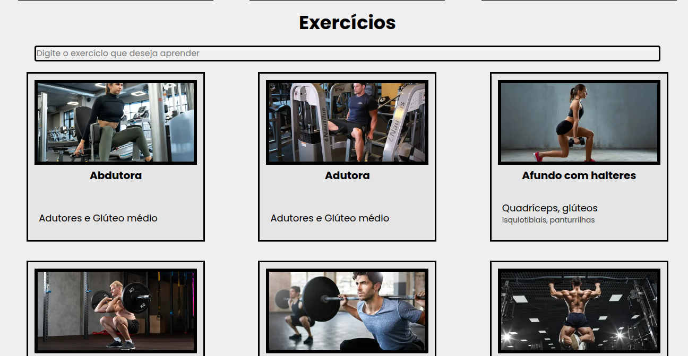
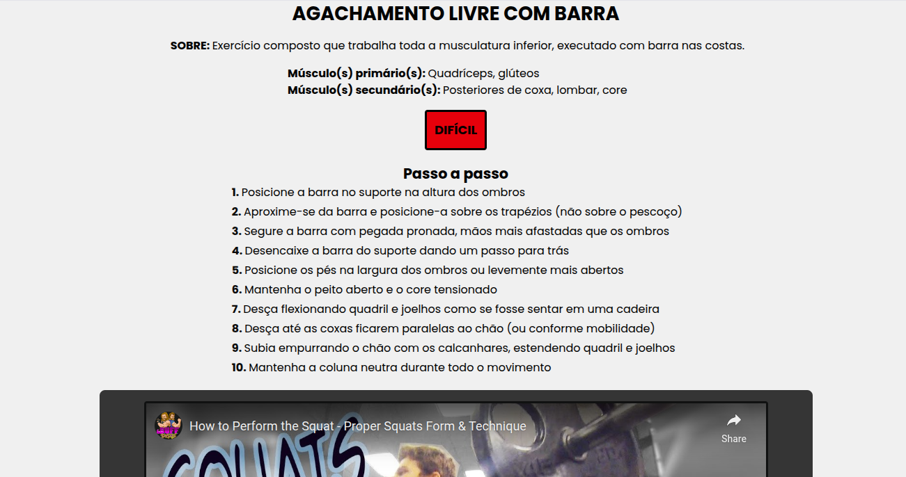
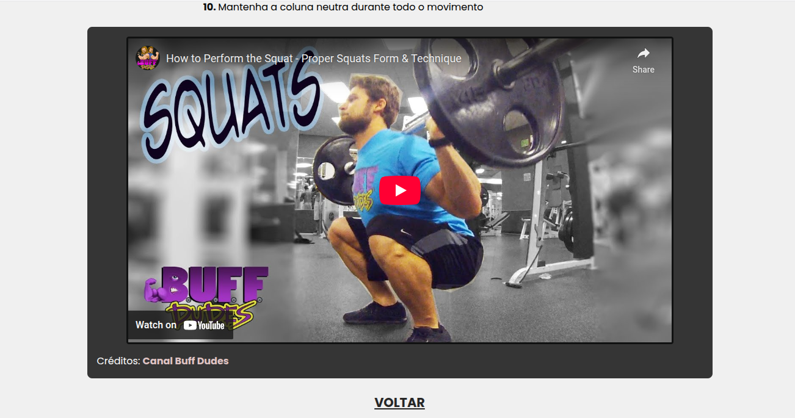

# ShapeView

[](http://makeapullrequest.com)


Projeto pessoal construído com React/Next.js, TypeScript e Tailwind CSS. O ShapeView é um site para pessoas que frequentam academia e possuem dificuldades com certos exercícios. Ele auxilia com o passo a passo de cada exercício que desejar, contando com vídeos explicativos (com os devidos créditos). A finalidade do projeto é solucionar um problema real que acontece com frequência na academia: executar os exercícios de forma correta para prevenir lesões.

## Demonstração

<p>
  
  
  
</p>

[Acesse a versão online aqui](https://shapeview.vercel.app)

## Funcionalidades
- Busca de exercícios por nome
- Passo a passo ilustrado
- Vídeos com créditos e links
- Layout responsivo com TailwindCSS

## Instruções de instalação

### Pré-requisitos

#### Node (18.x ou superior)

#### Npm (Junto com o Node)

#### Git (Para clonagem do projeto)

---

1. Crie uma pasta no computador, e rode com um terminal:

```bash
git clone https://github.com/luizfritoli/shapeview.git
```

2. Após isso, rode:

```bash
cd shapeview
```

3. Por fim, instale as dependências:

```bash
npm install
```

## Instruções de uso

1. Para rodar o projeto, abra o terminal do VS Code e use:

```bash
npm run dev
```

O projeto abrirá de forma automática. Ou entre em http://localhost:3000
após o uso do comando.

2. Ao rolar a página um pouco para baixo, é possível ver uma lista de exercícios
   de academia e um campo de texto. Nesta área, apenas procure pelo exercício desejado
   e clique nele.

3. Ao clicar no exercício desejado, o usuário é redirecionado para outra página,
   e verá um passo a passo de como executar o exercício desejado. Ao rolar a página
   para baixo, há um vídeo de exemplo para cada exercício, com os créditos e
   redirecionamento para os canais ao clicar no nome do autor do vídeo nos créditos.

4. Para voltar até a página inicial, basta clicar em um botão escrito "Voltar"
   abaixo de cada vídeo.
